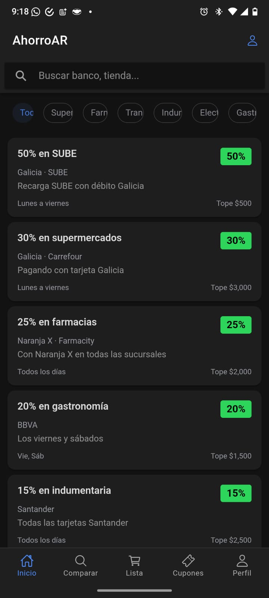
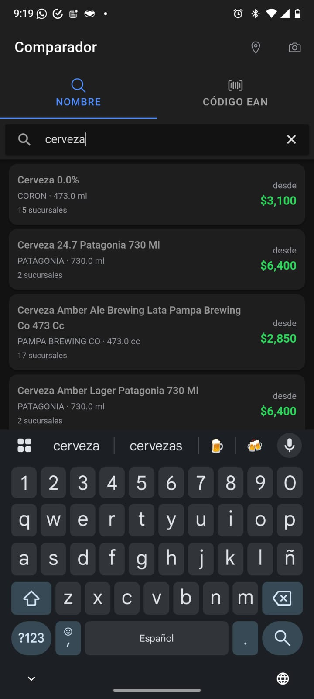
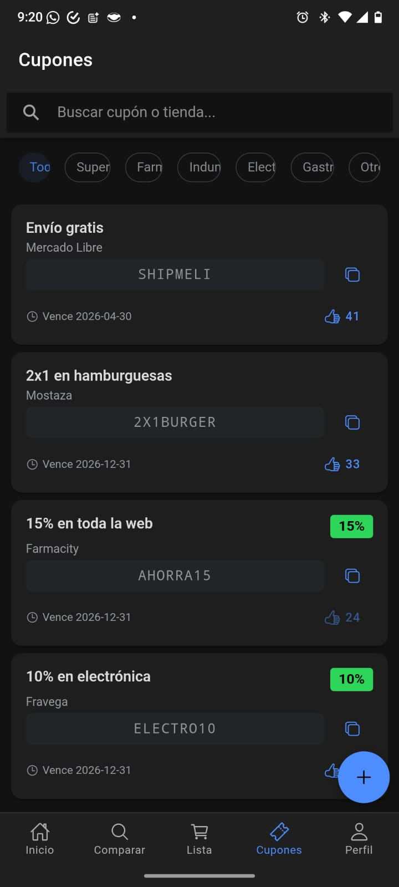

# 💸 AhorroAR — Smart Savings App for Argentina

A mobile app that helps Argentinians maximize their bank promotions, 
compare supermarket prices in real time, and make smarter purchasing 
decisions in a high-inflation context.

> 🚧 Actively in development — Phases 1-4 implemented.

---

## 🇦🇷 The Problem

In Argentina, every bank offers different discounts on different days, 
at different stores, with different caps. Tracking all of them manually 
is impossible. Meanwhile, the same product can vary 40%+ in price 
across supermarket chains.

AhorroAR centralizes all of that into one app.

---

## ✨ Features by Phase

### ✅ Phase 1 — MVP (Completed)
- 🔐 User authentication via Supabase Auth
- 🏷️ **Promotions module** — bank discounts with category and 
  bank filtering
- 💳 **Card wallet** — load your cards, see only your relevant promos
- 🤖 **Bank scraper v1** — automated daily scraping of Galicia, 
  Naranja X and BBVA using Playwright + cron jobs
- 🎟️ **Coupon module** — manual loading, categories, expiration dates

### ✅ Phase 2 — Price Comparator (Completed)
- 📊 **Precios Claros API** integration — official government 
  price database
- 🔍 **Price comparator** — search by name or EAN barcode, 
  compare prices across supermarket chains
- 🌐 **Multi-source EAN lookup** — if Precios Claros is down or 
  doesn't know the barcode, prices come from the chains' own 
  online-store APIs (Carrefour, DIA, Jumbo, Disco, Vea, ChangoMás, 
  Farmacity) and product metadata from Open Food Facts
- 📍 **Nearest branch** — geolocation + branch finder
- 📈 **Price history** — daily EAN snapshots to visualize 
  price trends over time
- 📷 **Scanner mode** — camera → barcode → instant price comparison 
  (ZXing)
- 🛒 **Smart list** — build your shopping list, app calculates 
  which supermarket minimizes total cost

### ✅ Phase 3 — Alerts & Community (Completed)
- 🔔 Price drop alerts — follow a product, get push notification 
  when it hits your target price (FCM + BullMQ)
- 📬 Weekly digest — best price drops in your personal basket
- ⏰ Coupon expiry alerts — push 24hs before a saved coupon expires
- 👥 Community reports — users submit prices, earn points and badges
- 🏦 Best bank combo — given a store + amount, calculates which 
  card gives the best deal

### ✅ Phase 4 — Personal Inflation & Monetization (Completed)
- 📉 **Personal inflation** — your basket's price curve vs official 
  CPI (INDEC API via datos.gob.ar time series)
- 🏪 **Expanded scrapers** — Carrefour, DIA, Jumbo, Disco, Vea, 
  Coto, La Anónima, ChangoMás and Farmacity
- 💰 **Affiliate coupons** — upload your own affiliate coupon with 
  its link and earn the commission
- 🏆 **Reputation system** — contributor ranking, badges and 
  community moderation (flagged reports get auto-hidden)
- 🩺 **Scraper monitor** — persistent run log + in-app dashboard 
  showing which scrapers are broken
- 📱 PWA (Angular service worker) → store publishing via Capacitor 
  pending

---

## 🛠️ Tech Stack

**Frontend & Mobile**
- Ionic + Angular · TypeScript

**Backend**
- NestJS · Node.js

**Database & Auth**
- Supabase (PostgreSQL + Auth)

**Automation & Data**
- Playwright (web scraping)
- BullMQ (job queues)
- ZXing (barcode scanning)
- Firebase Cloud Messaging (push notifications)

**External APIs**
- Precios Claros (official Argentine government price API)
- Google Maps (geolocation + branch finder)
- INDEC API (CPI / inflation data)

---

## 📸 Screenshots

<div align="center">
  
  &nbsp;&nbsp;
  
  &nbsp;&nbsp;
  
</div>

<div align="center">
  <em>Promotions Feed &nbsp;&nbsp;&nbsp;&nbsp;&nbsp;&nbsp;&nbsp;&nbsp;&nbsp;&nbsp;&nbsp;&nbsp; Price Comparator &nbsp;&nbsp;&nbsp;&nbsp;&nbsp;&nbsp;&nbsp;&nbsp;&nbsp;&nbsp;&nbsp;&nbsp; Coupons</em>
</div>

## 🚀 Getting Started
```bash
git clone https://github.com/kfernandezlopetegui/ahorroar.git

# Frontend
cd frontend
npm install
ionic serve

# Backend
cd backend
npm install
npm run start:dev
```

> ⚠️ Requires Supabase credentials and API keys. 
> Contact me for access to the development environment.

**Database migrations:** run the SQL files in [`db/migrations/`](./db/migrations) 
in the Supabase SQL Editor (latest: `2026-07-07_fase4.sql` — scraper monitor, 
affiliate coupons, report moderation).

---

## 👩‍💻 Author

**Karen Fernandez** —
[LinkedIn](https://linkedin.com/in/karenfernandez-056936341) ·
[GitHub](https://github.com/kfernandezlopetegui)
